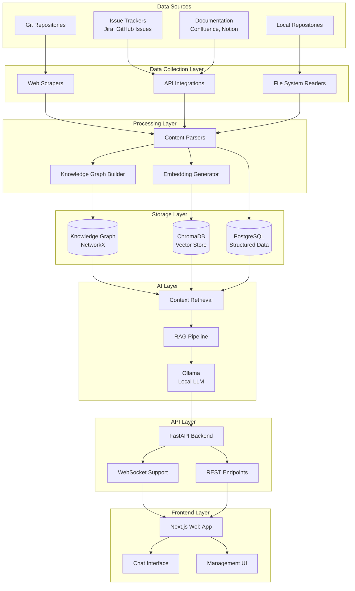

# DevSecrin Architecture

## System Overview

DevSecrin is a multi-layered AI-powered Developer Context Engine that creates a unified knowledge layer from disparate development tools and sources.

## Architecture Diagram

## Core Components

### 1. Data Collection Layer
- **Web Scrapers**: Extract content from documentation sites and wikis
- **API Integrations**: Connect to GitHub, Jira, Confluence APIs
- **File System Readers**: Process local repositories and documentation

### 2. Processing Layer
- **Content Parsers**: Parse and normalize data from various sources
- **Knowledge Graph Builder**: Creates relationships between entities (code, issues, docs)
- **Embedding Generator**: Converts content to vector embeddings for semantic search

### 3. Storage Layer
- **PostgreSQL**: Stores structured metadata, relationships, and configuration
- **ChromaDB**: Vector database for semantic similarity search
- **NetworkX Graph**: In-memory knowledge graph for relationship traversal

### 4. AI Layer
- **Ollama**: Local LLM inference (default: deepseek-r1:1.5b)
- **RAG Pipeline**: Retrieval-Augmented Generation for contextual responses
- **Context Retrieval**: Hybrid search combining vector similarity and graph relationships

### 5. API Layer
- **FastAPI Backend**: RESTful API and WebSocket support
- **Authentication**: Token-based API security
- **Rate Limiting**: Built-in request throttling

### 6. Frontend Layer
- **Next.js Web Application**: Modern React-based UI
- **Chat Interface**: Conversational AI interaction
- **Management UI**: Configuration and monitoring dashboard

## Data Flow

1. **Ingestion**: Data collectors continuously gather information from configured sources
2. **Processing**: Content is parsed, relationships extracted, and embeddings generated
3. **Storage**: Processed data is stored across multiple specialized databases
4. **Query**: User questions trigger hybrid retrieval from vector store and knowledge graph
5. **Generation**: Retrieved context is fed to the LLM for accurate, grounded responses
6. **Delivery**: Responses are delivered via real-time WebSocket or REST API

## Key Design Principles

### Graph-Enhanced RAG
Unlike traditional RAG systems that rely solely on vector similarity, DevSecrin combines:
- **Vector Search**: Semantic similarity for content discovery
- **Graph Traversal**: Relationship-based context expansion
- **Metadata Filtering**: Structured queries for precise results

### Local-First Architecture
- All AI processing happens locally using Ollama
- No external AI service dependencies
- Complete data privacy and control
- Offline capability for air-gapped environments

### Incremental Processing
- Real-time updates via WebSocket connections
- Incremental data ingestion and processing
- Change detection and delta updates
- Background processing for large repositories

## Scalability Considerations

### Horizontal Scaling
- Stateless API design enables load balancing
- Database connection pooling
- Distributed vector storage options
- Microservice decomposition ready

### Performance Optimization
- Embedding batch processing
- Intelligent caching strategies
- Lazy loading for large datasets
- GPU acceleration support

## Security Architecture

### Data Protection
- Local data processing and storage
- Configurable data retention policies
- Secure token management
- Input validation and sanitization

### Network Security
- CORS configuration
- SSL/TLS support
- Rate limiting and DDoS protection
- API key authentication